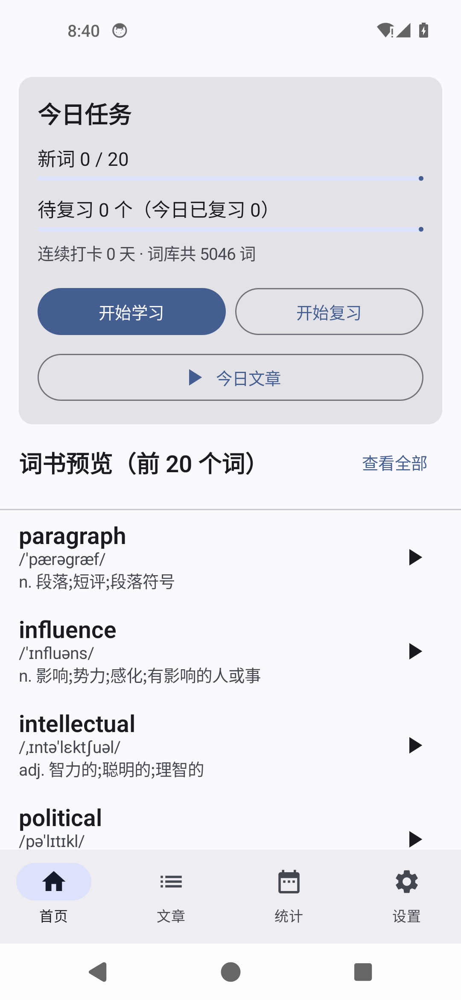
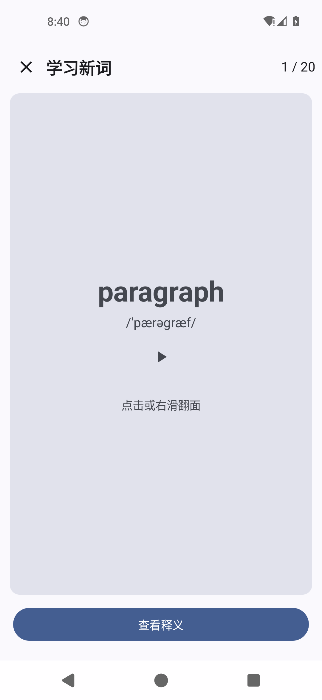
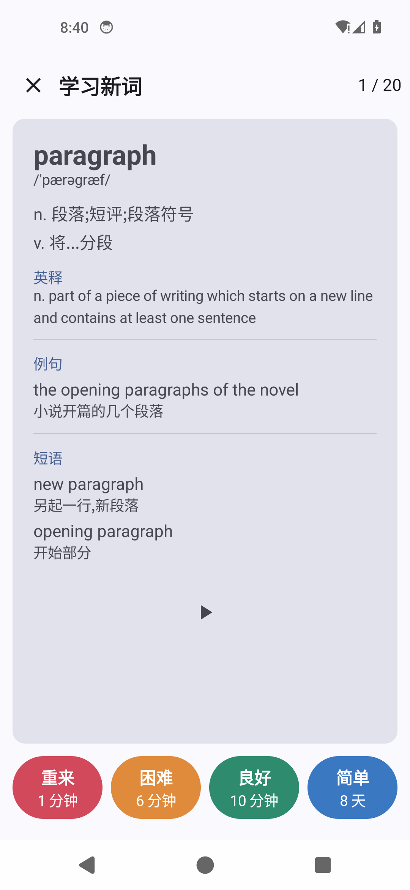
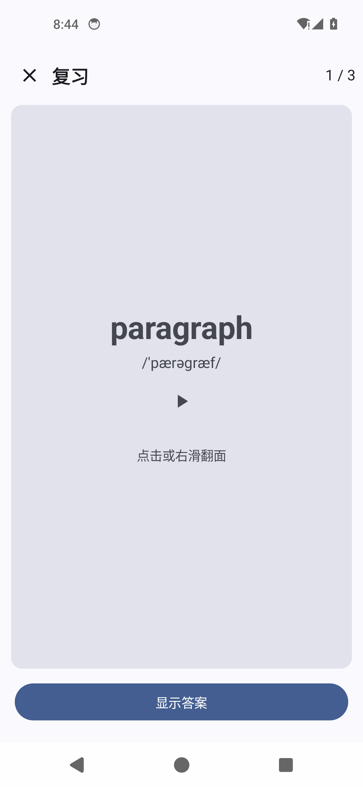
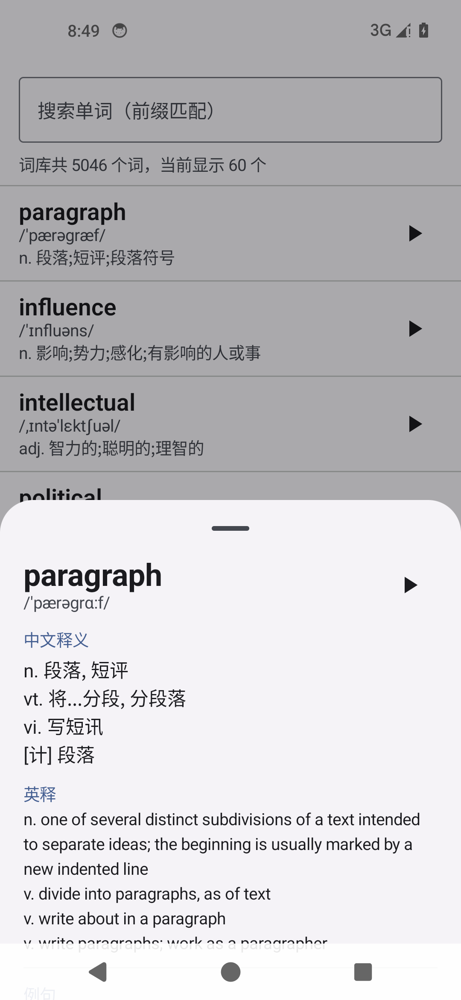
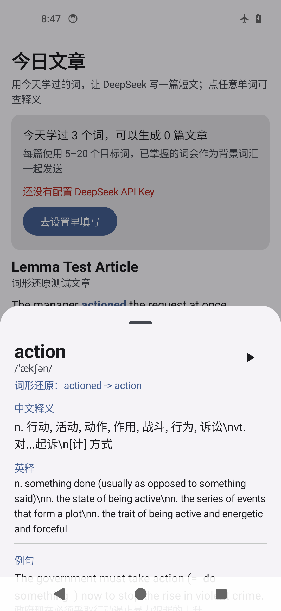
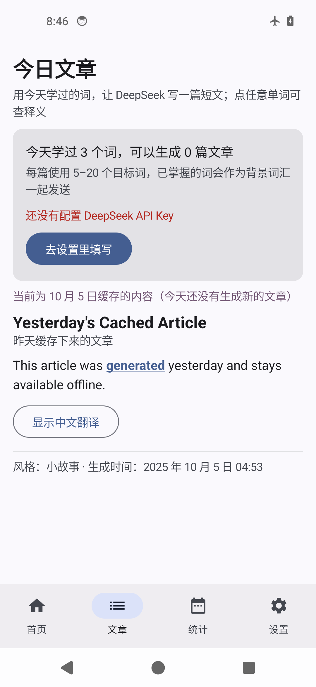
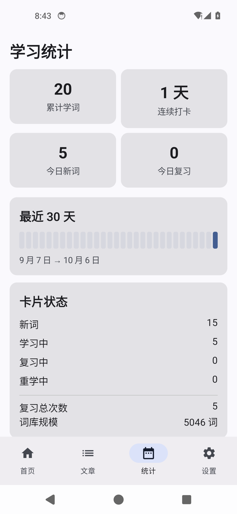

# 背单词 · 考研词汇（Android 个人自用）

> ## ⚠️ 版权与使用范围（先读这一段）
>
> 本项目的词库数据来自公开仓库，**内容本身源自商业词典**，请务必遵守以下约定：
>
> | 数据 | 来源 | 说明 |
> |------|------|------|
> | 学习词书 | [KyleBing/dict](https://github.com/KyleBing/dict)（kajweb/dict 的 fork） | 词书内容源自商业词典，版权不归本项目所有 |
> | 离线词典 | [skywind3000/ECDICT](https://github.com/skywind3000/ECDICT) | 开源（MIT），含词形变化字段 |
>
> **本项目仅供个人学习自用：**
> - ❌ 不得上架应用商店
> - ❌ 不得公开分发带词库的 APK
> - ❌ 不得用于任何商业用途
>
> 生成文章会调用 DeepSeek API，费用由使用者自行承担；API Key 只保存在本机，不会上传到任何第三方（除了 DeepSeek 官方接口）。

一个「只给自己用」的考研背单词 App：离线优先、FSRS-6 排程、点击文章单词毫秒级查词、每天用学过的词让 DeepSeek 写一篇短文。

---

## 一、功能一览

| 模块 | 实现情况 |
|------|----------|
| 学习新词 | 词卡正面只有单词 + 音标 + 发音，点击或右滑翻面看中文释义 / 英释 / 例句 / 短语；四档评分 |
| 复习 | 先只显示单词，点「显示答案」再看释义；队列 = 所有 `due <= now` 的卡，按到期时间升序 |
| 排程算法 | **FSRS-6**（Anki 现行算法），权重取自 open-spaced-repetition 官方实现，未凭记忆编造 |
| 复习日志 | 每次复习都落库：评分 / 时间 / 复习前 state·stability·difficulty / 复习后 state·stability·difficulty / 间隔 / 用时 |
| 每日文章 | DeepSeek Chat Completions，`response_format: json_object`，失败重试一次，成功后立刻落盘；断网显示上一次缓存 |
| 点击查词 | 完全离线，精确 → ECDICT exchange 词形还原（running→run）→ 前缀候选 → 未收录；LRU 缓存 |
| 设置 | 每日新词数、每日复习上限、顺序/乱序、文章风格、API Key（带显示/隐藏 + 测试连接）、提醒开关与时间、目标保持率 |
| 统计 | 累计学词、连续打卡、今日完成、30 天打卡条、卡片状态分布、最近文章 |
| 提醒 | WorkManager + 本地通知，默认 20:00，可开关 |
| 数据 | 导出 JSON（可分享）、清空全部数据 |
| 不做 | 账号、云同步、社交、付费、拼写/听音题型、文章 TTS（按需求文档「明确不做」） |

---

## 二、技术栈

- Kotlin + Jetpack Compose + Material 3，单 Activity（`MainActivity`）
- **Room (SQLite)** 存单词、卡片、复习日志、文章
- **DataStore (Preferences)** 存设置与 API Key
- **Retrofit + kotlinx.serialization + OkHttp** 调 DeepSeek
- **Hilt** 依赖注入（KSP），协程 + Flow 驱动 UI，无 RxJava
- MVVM + Repository，UI 层不直接碰 DAO / 网络
- minSdk 26，compileSdk / targetSdk 35，Gradle Kotlin DSL，AGP 8.7.3 / Gradle 8.11.1 / Kotlin 2.0.21

---

## 三、快速开始

### 1. 环境要求

- JDK 17
- Android SDK（platform 35 + build-tools 35.0.0）
- Python 3.9+（只用于生成词库）
- 在 `local.properties` 里配置 `sdk.dir=...`（该文件已在 .gitignore 中）

### 2. 生成词库（**assets 里的文件全部由脚本生成，不要手工塞**）

```bash
python tools/build_assets.py
```

脚本会：下载词书 JSON 与 ECDICT（缓存在 `tools/.cache/`，可重复运行）→ 清洗去重 → 生成

```
app/src/main/assets/words.db   考研词书（约 5000 词）
app/src/main/assets/dict.db    离线词典（约 1.9 万条 + 1.2 万条词形还原映射）
```

常用参数：`--no-download`（只用已缓存数据）、`--limit N`（调试）。

构建后会打印每本词书解析条数 / 去重后条数 / 重复丢弃数，以及两个 db 的体积。

### 3. 构建 APK

```bash
./gradlew :app:assembleDebug
# 产物：app/build/outputs/apk/debug/app-debug.apk
adb install -r app/build/outputs/apk/debug/app-debug.apk
```

### 4. 首次启动

1. 自动把词书导入 Room、把 `dict.db` 解压到应用私有目录（进度会显示在首页）
2. 首页显示今日任务、连续打卡、词书前 20 个词
3. 到「设置 → DeepSeek API」填 API Key，点「测试连接」确认可用

---

## 四、目录结构

```
Word-book/
├── app/src/main/java/com/wordbook/
│   ├── data/
│   │   ├── db/            Room 实体、DAO、AppDatabase
│   │   ├── assets/        AssetImporter：导入词书 + 解压离线词典
│   │   ├── dict/          DictRepository：离线查词 + 词形还原查询 + LRU
│   │   ├── prefs/         SettingsRepository（DataStore）
│   │   ├── remote/        DeepSeek 接口、DTO、ArticleGenerator（提示词在这里）
│   │   └── repo/          WordRepository / StudyRepository / ArticleRepository / StatsRepository
│   ├── domain/
│   │   ├── fsrs/          FSRS-6 排程器（官方实现的逐行移植）
│   │   ├── lemmatize/     WordNormalizer：大小写 / 标点 / 所有格 / 缩写 / 连字符
│   │   └── article/       文章 JSON 解析、分篇规则、内置示例文章
│   ├── ui/                home / study / article / words / dict / settings / stats / theme
│   ├── work/              ReminderWorker + ReminderScheduler
│   └── util/              Speaker(TTS)、Formatters、DataExporter
├── app/src/test/          单元测试（FSRS 黄金值、词形还原、文章 JSON、分篇规则）
├── tools/
│   ├── build_assets.py    词库构建脚本（唯一的数据入口）
│   ├── verify/
│   │   ├── check_assets.py          校验生成的 words.db / dict.db
│   │   └── generate_fsrs_golden.py  用官方 py-fsrs 生成排程黄金值
│   └── .cache/            下载缓存（不入库）
└── 背单词App-提示词.md / 背单词App-需求记录.md   需求文档（仓库外，见工作台目录）
```

---

## 五、核心实现说明

### 1. FSRS-6（`domain/fsrs/`）

- 权重、上下界、衰减参数、fuzz 区间全部来自官方实现
  [open-spaced-repetition/py-fsrs](https://github.com/open-spaced-repetition/py-fsrs) v6.3.2 的 `fsrs/scheduler.py`（21 个参数，`FSRS_DEFAULT_DECAY = 0.1542`），源码注释里写明了出处与取回日期。
- 官方实现的分支（学习步 1 分钟 / 10 分钟、重学步 10 分钟、短期记忆公式、难度线性阻尼 + 均值回归、间隔 fuzz）逐行移植，索引与官方一致。
- **正确性验证**：`tools/verify/generate_fsrs_golden.py` 调用官方 Python 实现跑 6 个场景，把每一步的 state / step / stability / difficulty / 间隔写进 `app/src/test/resources/fsrs_golden.json`；Kotlin 侧 `FsrsGoldenTest` 重放同样的评分序列，逐值比对（容差 1e-9）。
- 没有降级为 SM-2，也没有使用固定的 1/2/4/7 天间隔。

### 2. 复习日志（`review_logs` 表）

每条日志记录：`cardId, wordId, rating, reviewedAt, dayKey, stateBefore, stabilityBefore, difficultyBefore, stateAfter, stabilityAfter, difficultyAfter, intervalAfterMs, elapsedDays, durationMs`。
字段与 FSRS Optimizer 需要的输入一致，将来可以直接拿去重新拟合个人参数。

### 3. 离线查词（`data/dict/` + `domain/lemmatize/`）

查询顺序：

1. 精确匹配（`word = ? COLLATE NOCASE`）
2. **词形还原**：查 `lemma` 表（由 ECDICT `exchange` 字段展开，12,351 条映射）
3. 前缀模糊匹配，给出候选列表
4. 都没命中 → 「词典未收录这个词」

文本清洗覆盖：大小写、句尾标点、引号括号、连字符（`well-known` → `well known`/`well`）、所有格（`Mom's` → `mom`）、常见缩写（`don't` → `do`、`we've` → `we`）。
结果做 LRU 缓存（512 条），同一篇文章反复点同一个词几乎零开销。**查词不联网、不调用大模型。**

### 4. 每日文章（`data/remote/ArticleGenerator.kt`）

- 提示词模板与需求文档逐字一致（目标词 + 背景词汇表 + 风格 + JSON 结构 + `occurrences` 要求）
- 输入：今天学习/复习过的词；5–20 个 → 一篇，超过 20 个 → 平均拆成多篇（每篇 ≤ 20），**不会把所有词硬塞进一篇**；今天学过的词少于 5 个时按钮禁用并提示
- 背景词汇：已学过的词最多 500 个
- `response_format = {"type":"json_object"}`，失败重试 1 次；`401 / 402 / 429 / 5xx / 超时 / DNS` 都有对应的中文提示
- 成功后立刻写 Room（存原始 JSON），断网或生成失败时展示上一次缓存并提示「当前为 X 月 X 日缓存的内容」
- 没有任何缓存时展示内置示例文章（含 `running` / `went` 等变形词），保证离线也能体验点击查词

### 5. 提醒（`work/`）

WorkManager 周期任务，`initialDelay` 计算到下一个设定时刻；到点检查今日任务并本地通知。通知权限在开启提醒时申请（Android 13+）。

---

## 六、验证方法

### 单元测试

```bash
./gradlew :app:testDebugUnitTest
```

覆盖：

| 测试 | 内容 |
|------|------|
| `FsrsGoldenTest` | 与官方 py-fsrs 逐值一致；新卡评「良好」的首次间隔；评「重来」重新入队；到期时间 = 复习时间 + 间隔；fuzz 区间；目标保持率影响间隔 |
| `WordNormalizerTest` | 大小写 / 标点 / 所有格 / 缩写 / 连字符 / 空输入 |
| `ArticleJsonParserTest` | 标准 JSON、Markdown 代码块、夹杂解释文字、未知字段、缺段落、非 JSON、序列化往返 |
| `ArticlePlanTest` | 少于 5 个词不生成；5–20 一篇；超过 20 自动分篇且每篇 ≤ 20 |
| `StudyFlowIntegrationTest`（Robolectric） | 用 **真实的 assets/words.db 与 dict.db** 跑端到端：首次启动导入词书（幂等）、学 20 个新词 → 评分 → 卡片与复习日志落库 → 今日任务计数、评「重来」后 1 分钟内重新到期并计入 lapses、到期卡进入复习队列、离线查词（精确 / 词形还原 / 前缀候选 / 未收录） |

> 集成测试在开发过程中真的抓到过一个 bug：`newWordSession()` 里用 `also` 返回了原始对象，
> 导致插入数据库生成的卡片 id 被丢掉（一直是 0），评分时 update 匹配不到任何行。
> 现已改为 `run` + `copy`，并由该测试守住。

### 在 Android 模拟器上跑真实 UI（2026-10-06 实测）

环境：AVD `wordbook`（Pixel 5 / Android 14 / x86_64）+ Android Emulator Hypervisor Driver 2.2。
> Windows 上如果 `emulator -accel-check` 提示没有加速驱动，装一下
> `extras;google;Android_Emulator_Hypervisor_Driver` 里的 `silent_install.bat`（需要管理员权限）。
> 纯软件（`-accel off`）模式在这版模拟器上会段错误，跑不起来。

| 截图 | 验证点 |
|------|--------|
|  | 首次启动自动导入 5046 词、今日任务卡、连续打卡、词书前 20 个词 |
|  | 正面只有单词 + 音标 + 发音按钮，点击/右滑翻面 |
|  | 背面中文释义 / 英释 / 例句 / 短语；四档预估间隔 **1 分钟 / 6 分钟 / 10 分钟 / 8 天** |
|  | 复习先只显示单词，点「显示答案」才出释义，四档为 **1 分钟 / 10 分钟 / 2 天 / 4 天** |
|  | 目标词高亮（decided / go running / went / improved / thinking / Running） |
|  | 点单词弹出离线词典，多行释义正常换行 |
|  | `actioned`（词典没收录）→ 还原成 `action`，并提示「词形还原：actioned -> action」 |
|  | 飞行模式下学习、查词照常；文章显示「当前为 10 月 5 日缓存的内容」 |
|  | 累计学词 / 连续打卡 / 30 天打卡条 / 卡片状态分布 |
|  | **DeepSeek 真实生成**（`POST /chat/completions 200`）：4 段 158 词，5 个目标词全部高亮 |
|  | 断网点「重新生成」：中文错误提示 + 重试按钮，**上一篇缓存原样保留** |

关键日志与数据（从设备上直接读出来的，不是推测）：

```
I AssetImporter: 词书导入完成，共 5046 个词
I AssetImporter: 离线词典已解压：/data/user/0/com.wordbook/files/dict/dict.db (6819840 bytes)

review_logs：评分=3 前(state=0, stability=None,     difficulty=None)     → 后(stability=2.3065, difficulty=2.1181) 间隔=600000ms
            评分=3 前(state=1, stability=2.3065,   difficulty=2.1181)  → 后(stability=2.3065, difficulty=2.1112) 间隔=172800000ms
cards：paragraph  state=2(Review) step=null stability=2.3065 difficulty=2.1112 reps=2 lapses=0
```

（`2.3065` 就是官方 FSRS-6 的 `w2`——新卡评「良好」的初始 stability，和黄金值一致。）

其他实机验证过的行为：

- 设置**即时生效**：每日新词数从 20 调到 4 后首页立刻变成「新词 x / 4」；打开「新词乱序」后第一张卡从顺序的 `political` 变成随机的 `portion`
- 复习队列：把所有已学卡片到期时间改到 1 分钟前后，首页显示「待复习 3 个」，复习完 1 张立刻变成「待复习 2 个（今日已复习 1）」
- `pm clear` 后重新启动，导入流程可重复执行，没有崩溃

### 词库校验

```bash
python tools/verify/check_assets.py
```

检查表结构与 Kotlin 侧读取顺序一致、无空词无重复、音标/释义/例句齐全，以及 `running`→`run` 这类词形还原是否可用。

### 重新生成 FSRS 黄金值

```bash
python tools/verify/generate_fsrs_golden.py
```

---

## 七、验收清单自查

| 验收项 | 状态 | 说明 |
|--------|------|------|
| 断网能学新词 / 复习 / 查词，只有生成文章不可用且显示缓存 | ✅ | 除文章生成外全部本地；文章页无缓存时展示内置示例并明确标注 |
| 复习到期时间符合 FSRS，不是固定 1/2/4/7 天 | ✅ | 与官方 py-fsrs 逐值比对通过 |
| 每次复习都写完整日志 | ✅ | `review_logs` 单条 insert，含复习前后全部字段 |
| 文章里变形词能查到原形 | ✅ | 词典 `lemma` 表 + 清洗规则；`check_assets.py` 验证 |
| 生成文章目标词全出现、高亮正确 | ✅ | 提示词强制 `occurrences`；客户端按 `occurrences` 归一化高亮 |
| 生成失败/超时不白屏，有中文提示且可重试 | ✅ | 统一 `DeepSeekException` + 页面重试按钮 |
| API Key 不出现在任何提交文件里 | ✅ | 只存 DataStore；源码中无任何 Key；`local.properties`、`.cache` 已 gitignore |
| 每日新词数改成 5 或 50 立即生效 | ✅ | 设置项实时写入 DataStore，`newWordSession()` 每次读取 |
| 词库由脚本生成，可重复运行 | ✅ | `python tools/build_assets.py`；下载有缓存，重复运行结果一致 |
| 无严重编译问题，测试全通过 | ✅ | 见下方「构建与测试结果」 |

---

## 八、构建与测试结果

> 本节数字由本机实际运行产生（JDK 17.0.2 + Gradle 8.11.1 + Android SDK 35）。

**单元测试 `./gradlew :app:testDebugUnitTest`：29 个用例全部通过，0 失败**

| 测试类 | 用例数 |
|--------|--------|
| `FsrsGoldenTest` | 6 |
| `WordNormalizerTest` | 7 |
| `ArticleJsonParserTest` | 7 |
| `ArticlePlanTest` | 5 |
| `StudyFlowIntegrationTest`（Robolectric） | 4 |

**构建**

| 产物 | 大小 | 说明 |
|------|------|------|
| `app/build/outputs/apk/debug/app-debug.apk` | **23.3 MB** | 可直接安装（debug 签名） |
| `app/build/outputs/apk/release/app-release-unsigned.apk` | **12.9 MB** | 已开启 R8 混淆 + 资源压缩，需自己签名后才能安装 |

两者都远低于 50 MB 的体积目标；APK 内 `assets/words.db`(4.1 MB) 与 `assets/dict.db`(6.5 MB) 以**未压缩**方式存放（`noCompress += "db"`），首次启动才能用 `openFd()` 读取体积并快速解压。

**静态检查 `./gradlew :app:lintDebug`：0 error**（只剩 4 条风格类 warning：默认 Locale、可省略的 label、Compose modifier 参数顺序、v26 目录限定符；不影响运行）。

**词库构建 `python tools/build_assets.py`**

```
KaoYan_2        解析 4533 条 → 全部保留
KaoYan_3        解析 3727 条 → 保留 417（3310 条与主词书重复）
KaoYanluan_1    解析 1341 条 → 保留  96（1245 条重复）
words.db 共 5046 词，3.94 MB
dict.db  来源 770611 条 → 考试词 7394 + 词形变体 12169 → 收录 19365 条，词形还原表 12351 条，6.50 MB
```

**产物校验 `python tools/verify/check_assets.py`：全部检查通过**

---

## 九、实机验证中发现并修掉的问题

跑模拟器最大的价值是：这三个问题静态检查和单元测试都发现不了。

| # | 问题 | 表现 | 修法 |
|---|------|------|------|
| 1 | `cachedNotice` 字段在 ViewModel 里算好了，但界面**从来没渲染** | 断网时只显示旧文章，却不提示「当前为 X 月 X 日缓存的内容」——正是需求里明确要求的那句 | 在 `ArticleScreen` 里真正显示出来 |
| 2 | `lemmaNote` 拿「还原后的词条」和「词条自己」比较 | `actioned -> action` 的提示永远不会出现 | 改成和用户点的**原始形态**比较 |
| 3 | ECDICT 的 `translation` / `definition` 里的换行是**字面量 `\n`**（反斜杠 + n） | 查词弹层里释义显示成 `n. 行动...\nvt. 对...起诉` | 在 `build_assets.py` 里统一还原成真换行，重新生成 dict.db |

## 十、DeepSeek 联调（HTTP 422 的坑）

第一个版本点「测试连接」报 **`连接失败：请求被拒绝（HTTP 422）`**，日志里能看到请求体只有 91 字节：

```
I okhttp.OkHttpClient: --> POST https://api.deepseek.com/chat/completions (91-byte body)
I okhttp.OkHttpClient: <-- 422 https://api.deepseek.com/chat/completions (259ms, 249-byte body)
```

原因是 **kotlinx.serialization 默认 `encodeDefaults = false`**：它会跳过所有"值等于默认值"的字段，
而 `ChatRequest` 的 `model` / `temperature` / `stream` 三个字段都带默认值，于是发出去的 body 变成了

```json
{"messages":[{"role":"user","content":"Reply with the single word: ok"}]}
```

少了 `model` 字段，DeepSeek 直接 422。修法是给 Retrofit 用的那个 `Json` 加上 `encodeDefaults = true`
（`di/NetworkModule.kt`），修完请求体 130 字节 → `200 OK`，模型回复「ok」。

真实生成也验证过了：5 个刚学的词 → `POST /chat/completions (1432-byte body) → 200`，
返回 4 段 158 词的小故事，5 个目标词全部自然出现，`occurrences` 列出的 14 个实际形态在正文中都能找到。

---

## 十一、版本管理与发版流程

本仓库用 git 管理版本，**一个版本 = 一个 commit + 一个 tag**。

```bash
git log --oneline --decorate    # 版本历史
git tag -l                      # 所有版本号
git show v1.0.0 --stat          # 某个版本改了什么
```

**发一个新版本：**

1. 改 `app/build.gradle.kts`：`versionCode` 每次 +1，`versionName` 用语义化版本号（如 1.1.0）
2. 在 `CHANGELOG.md` 顶部加一段本次改动
3. `git add -A && git commit -m "v1.1.0: ..." && git tag -a v1.1.0 -m "v1.1.0"`
4. `./gradlew :app:assembleDebug` 出包

**不会入库的东西**（原因见 `.gitignore` 里的注释）：

| 路径 | 为什么不入库 |
|------|--------------|
| `app/src/main/assets/*.db` | 由 `tools/build_assets.py` 生成；内容是第三方词典，避免"公开分发词库"的版权风险 |
| `*.apk` | 构建产物，而且带词库的 APK 同样不适合公开分发 |
| `local.properties` | 本机 SDK 路径 |
| `tools/.cache/` | 下载缓存，几百 MB |

克隆之后先跑一次 `python tools/build_assets.py` 生成词库，再构建。

> ⚠️ **不要把这个仓库推到公开平台**：即使不带数据文件，README 里也写明了词库来源，
> 而 KyleBing/dict 的内容源自商业词典，只允许个人自用。

---

## 十二、已知限制

- UI 已在 Android 14 模拟器上完整走过一遍（截图见上），但**没有在真机上测过**，字体、TTS 发音、通知在这些方面可能有差异。
- 词书去重后约 5000 词（三本词书互相重叠较多），如果觉得词汇量不够，可以在 `tools/build_assets.py` 的 `DECKS` 里加入其他词书文件。
- FSRS 参数目前使用官方默认值，尚未用你的复习日志做个性化拟合（日志已经按 Optimizer 所需格式存好了）。
- 首版未做：文章 TTS、拼写/听音题型、云备份。
