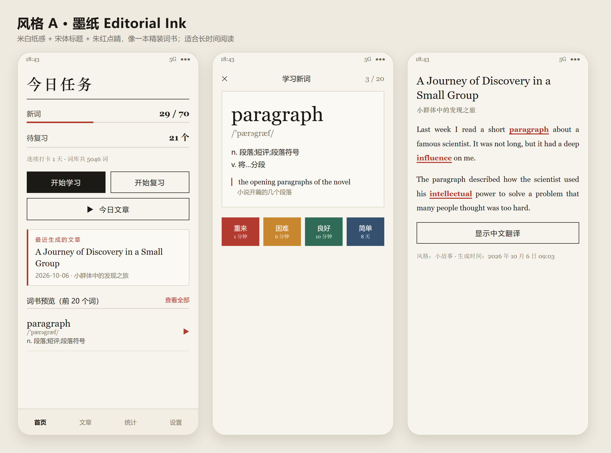
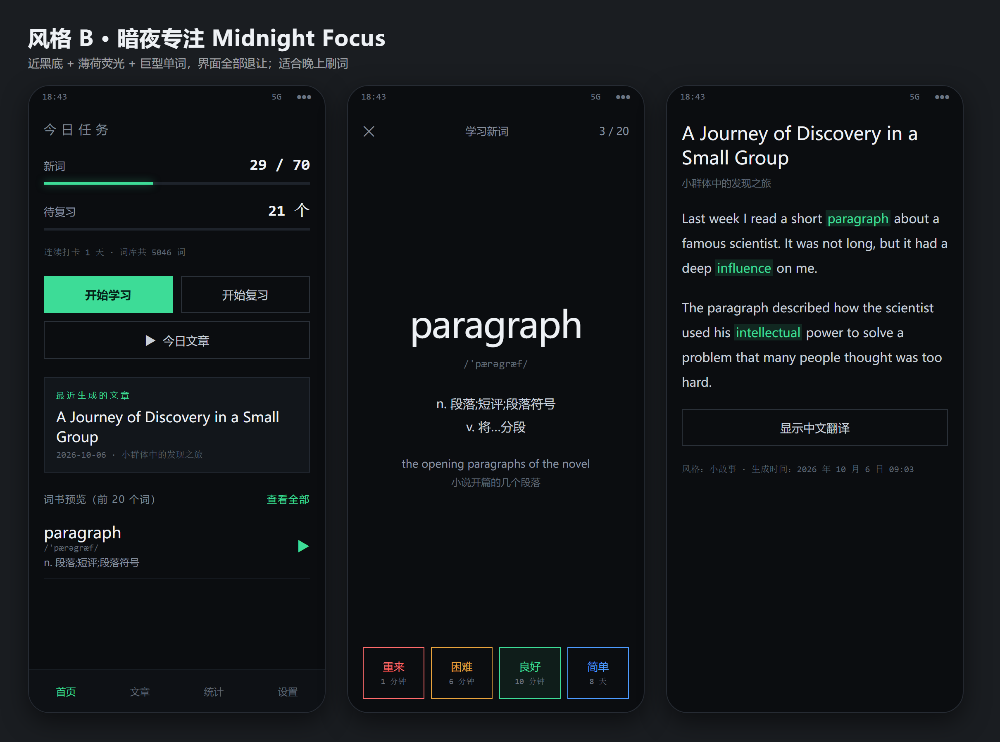
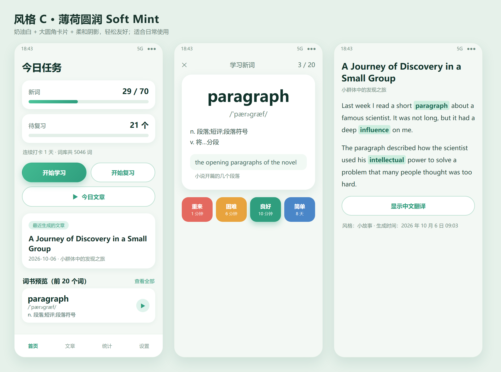
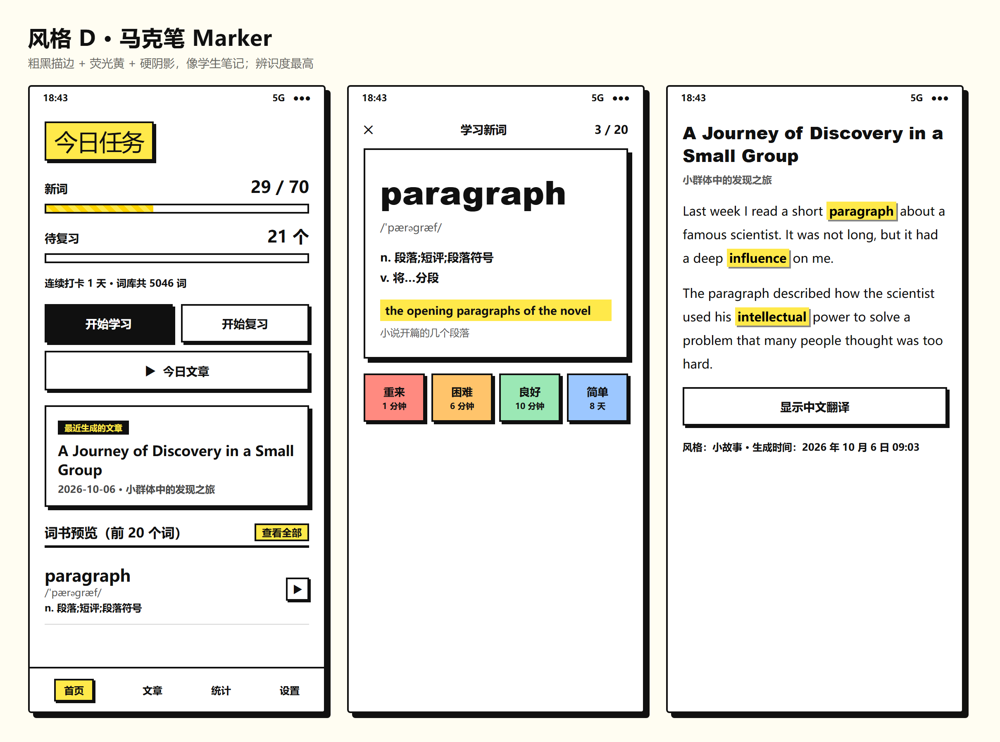

# 界面风格样板（4 选 1）

同一套内容（**首页 / 学习卡 / 文章页**）用四种完全不同的设计语言渲染，方便对比挑选。

| | 风格 | 一句话 | 落地成本 |
|---|------|--------|----------|
| A | [墨纸 Editorial Ink](style-a.png) | 米白纸感 + 宋体标题 + 朱红点睛，像一本精装词书 | ⭐ 低 |
| B | [暗夜专注 Midnight Focus](style-b.png) | 近黑底 + 薄荷荧光 + 巨型单词，界面全部退让 | ⭐ 低 |
| C | [薄荷圆润 Soft Mint](style-c.png) | 奶油白 + 大圆角卡片 + 柔和阴影，轻松友好 | ⭐⭐ 中 |
| D | [马克笔 Marker](style-d.png) | 粗黑描边 + 荧光黄 + 硬阴影，像学生笔记 | ⭐⭐⭐ 高 |

---

## A · 墨纸 Editorial Ink

- **气质**：把 App 当成一本装帧考究的词书。留白多、线条细、没有多余装饰。
- **配色**：纸白 `#F7F4ED` / 墨黑 `#1B1A17` / 朱红 `#B23A2E` / 灰 `#7C755F`
- **字体**：标题 华文中宋（宋体系）；单词与例句 Georgia（衬线）；正文 微软雅黑
- **特征**：直角卡片、1px 分隔线、细线进度条（没有圆角色块）
- **适合**：每天读文章、长时间看不累眼；最"耐看"的一版
- **Compose 落地**：改 `Theme.kt` 配色 + `Shapes` 全部设为 0dp + 标题用 `FontFamily.Serif`；
  进度条改细线、卡片加 `BorderStroke(1.dp)`。**约 1 天，改动集中在主题层**

## B · 暗夜专注 Midnight Focus

- **气质**：夜间刷词模式。单词是绝对主角，其它元素全部压低对比度退到背景里。
- **配色**：近黑 `#0B0D10` / 卡片 `#16191B` / 薄荷荧光 `#3DDC97` / 文字 `#C7CFD9`
- **字体**：微软雅黑 + 音标/数字用 Consolas 等宽
- **特征**：巨型单词居中、顶部 3px 发光进度条、方角按钮、评分按钮用颜色描边而非填充
- **适合**：晚上学、想快速过词的时候
- **Compose 落地**：强制走 `darkColorScheme`（关掉动态取色）+ 大面积字号调整。
  **约 1 天，主要是主题 + 学习卡排版**

## C · 薄荷圆润 Soft Mint

- **气质**：轻松、友好、没有学习压力。圆角和柔和阴影是主角。
- **配色**：奶油白 `#F3F8F4` / 薄荷绿 `#2F9E7E` / 浅薄荷容器 `#DFF3EC` / 暖橙点缀
- **字体**：微软雅黑（偏粗）
- **特征**：18–24px 大圆角卡片、胶囊按钮、渐变主按钮、统计数字放在独立白卡里
- **适合**：白天日常用，最"现代 App"的一版
- **Compose 落地**：`Shapes` 全部换成大圆角 + 卡片加 `elevation` + 按钮改胶囊形。
  **约 1–2 天，主题 + 按钮/卡片组件**

## D · 马克笔 Marker

- **气质**：学生笔记本。粗描边、硬阴影、荧光黄高亮，识别度最高也最"有性格"。
- **配色**：纯白 / 纯黑 `#101010` / 荧光黄 `#FFE94A` / 评分按钮用四种柔和荧光色
- **字体**：标题 Arial Black / 雅黑加粗；正文雅黑
- **特征**：2px 描边 + 4px 无模糊硬阴影、高亮目标词像被马克笔画过、标签用黑底黄字
- **适合**：想让目标词一眼可见；习惯手写笔记的人
- **Compose 落地**：卡片要自己画描边 + 用 `Modifier.offset` 叠一个黑色面做硬阴影
  （Compose 自带阴影是模糊的做不出这种效果），高亮样式也要重写。**约 2–3 天，改动最大**

---

## 怎么定

回复 **A / B / C / D** 就行。也可以混搭，例如：

- "A 的配色 + C 的圆角" —— 书卷气但手感更软
- "B 的暗色 + D 的高亮" —— 夜间刷词、目标词荧光突出
- "C 为主，但标题换成 A 的宋体"

定下来之后我会：把它落实到 Compose 主题（`ui/theme/`）+ 相关组件，在模拟器上逐屏比对，
出 v1.1.0 版本。

> 样板是 HTML/CSS 做的（更快、改起来成本低），文字排版与真实 Compose 渲染会有极小差异；
> 选定后我会按 Android 实际渲染再微调一次。
>
> 重新生成：`bash tools/verify/render_style_mockups.sh`
